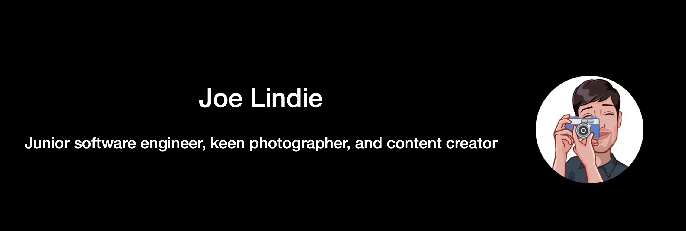

# Hello! 👋🏽 Joe Lindie | FAC25

## **About Me 🤷‍♂️**  
### Hi, I'm Joe (he/him). I am an aspiring Software Engineer with a background in Railway Infrastructure. I am currently on the [Founders & Coders Programme](https://www.foundersandcoders.com/ ) (FAC25). Railway Infrastructure to Software Engineer, you may ask? My newfound passion for programming started when I wanted to build a website to host my content 📸. (You can see my photography [here](https://joe-lindie.github.io/Bindus-Photography/).) Since then, I have developed a solid foundation in HTML, CSS, and Javascript. As well as being part of Founders & Coders, I attend weekly meetups at [Codebar](https://codebar.io/) and hone my new skills through FreeCodeCamp, Execute Programme and hundreds of hours of practice. 
 

## **Digital Presence 🌍** 
- 🔎 Linkdin profile [here!](https://www.linkedin.com/in/joelindie/)
  
- 🔎 Github profile [here!](https://github.com/Joe-Lindie) 

